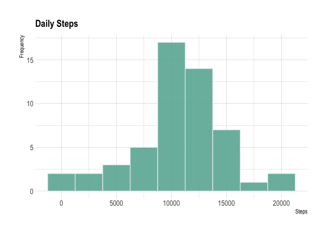
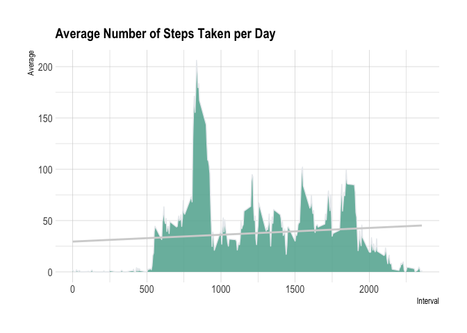
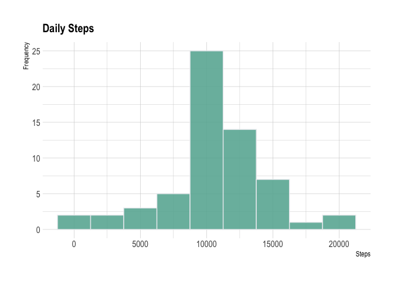
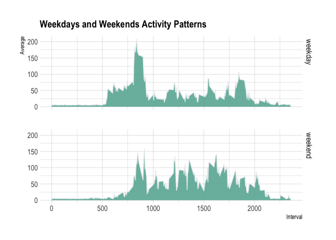

### Loading and preprocessing the data


```r
        # Unpack dataset into data directory
        unzip("activity.zip",exdir = "data")
```


```r
        # Mounting datatable from CSV
        activityDataset <- data.table::fread(input = "data/activity.csv")
```


### What is mean total number of steps taken per day?

```r
        # Calculating the number of steps per day and show some sample
        TotalSteps <- activityDataset[, c(lapply(.SD, sum, na.rm = FALSE)), .SDcols = c("steps"), by = .(date)] 
        head(TotalSteps, 5)
```

```
##          date steps
## 1: 2012-10-01    NA
## 2: 2012-10-02   126
## 3: 2012-10-03 11352
## 4: 2012-10-04 12116
## 5: 2012-10-05 13294
```

```r
        # Calculating the mean of total number of steps 
        TotalSteps[, .(MeanSteps = mean(steps, na.rm = TRUE), MedianSteps = median(steps, na.rm = TRUE))]
```

```
##    MeanSteps MedianSteps
## 1:  10766.19       10765
```

##### Visualization for distribution of daily steps 
<!-- -->

### What is the average daily activity pattern?

```r
    # Calculating time series by interval
     IntervalDataset <- activityDataset[, c(lapply(.SD, mean, na.rm = TRUE)), .SDcols = c("steps"), by = .(interval)] 
```


```r
    # Ploting time series of the 5-minute interval
    ggplot(IntervalDataset, aes(x = interval , y = steps)) + 
      geom_area(fill="#69b3a2", color="#e9ecef", alpha=0.9, size=.5) +
      geom_smooth(method=lm , color="lightgrey", se=FALSE) +
      labs(title = "Average Number of Steps Taken per Day", x = "Interval", y = "Average") +
      theme_ipsum() +
      theme(
          plot.title = element_text(size=15)
      )
```

<!-- -->


```r
    # Which 5-minute interval that contains the maximum number of steps
    IntervalDataset[steps == max(steps), .(max_interval = interval)]
```

```
##    max_interval
## 1:          835
```

### Imputing missing values

```r
    # Calculating amount of missing values
    activityDataset[is.na(steps), .N ]
```

```
## [1] 2304
```


```r
    # Replacing missing values with mean of steps in dataset and generating new file
    activityDataset[is.na(steps), "steps"] <- activityDataset[, c(lapply(.SD, mean, na.rm = TRUE)), .SDcols = c("steps")]
    data.table::fwrite(x = activityDataset, file = "data/tidy.csv", quote = FALSE)
```

4. Make a histogram of the total number of steps taken each day and calculate and report the mean and median total number of steps taken per day. Do these values differ from the estimates from the first part of the assignment? What is the impact of imputing missing data on the estimates of the total daily number of steps?


```r
  # Recalculating total number of steps taken per day
  TotalSteps <- activityDataset[, c(lapply(.SD, sum)), .SDcols = c("steps"), by = .(date)] 
  # Recalculating mean and median total number of steps taken per day
  TotalSteps[, .(MeanSteps = mean(steps), MedianSteps = median(steps))]
```

```
##    MeanSteps MedianSteps
## 1:  10751.74       10656
```

```r
      # Replotting histogram for steps per day without missing values
        ggplot(TotalSteps, aes(x=steps)) +
            geom_histogram( binwidth=2500, fill="#69b3a2", color="#e9ecef", alpha=0.9) +
            labs(title = "Daily Steps", x = "Steps", y = "Frequency") +
            theme_ipsum() +
            theme(
              plot.title = element_text(size=15)
    ) 
```

<!-- -->

### Are there differences in activity patterns between weekdays and weekends?

```r
      # Creating a new factor variable in the dataset with levels “weekday” and “weekend” 
      activityDataset$date <- as.Date(activityDataset$date)
      activityDataset$weekday <- weekdays(activityDataset$date)
      activityDataset$DayType <- ifelse(activityDataset$weekday=="Sábado" | activityDataset$weekday=="Domingo", "weekend", "weekday")
      activityDataset$DayType <- factor(activityDataset$DayType)
      activityDataset[sample(.N, 10)]
```

```
##     steps       date interval      weekday DayType
##  1:   527 2012-10-27      855       Sábado weekend
##  2:     0 2012-10-28       40      Domingo weekend
##  3:    37 2012-11-01      830 Quinta Feira weekday
##  4:   768 2012-11-24     1605       Sábado weekend
##  5:     0 2012-10-12      955  Sexta Feira weekday
##  6:    37 2012-11-01     1240 Quinta Feira weekday
##  7:     0 2012-10-10     1430 Quarta Feira weekday
##  8:     0 2012-10-21     1230      Domingo weekend
##  9:     0 2012-10-17       10 Quarta Feira weekday
## 10:     0 2012-10-20     1310       Sábado weekend
```

```r
      # Grouping data by factor
      dayByType <- aggregate(steps ~ interval + DayType, data=activityDataset, mean)
```


```r
      # Ploting comparative geom area chart
      ggplot(dayByType, aes(x = interval , y = steps)) + 
      geom_area(fill="#69b3a2", color="#e9ecef", alpha=0.9, size=.5) +
      facet_grid(DayType ~ .) +
      labs(title = "Weekdays and Weekends Activity Patterns", x = "Interval", y = "Average") +
      theme_ipsum() +
      theme(
          plot.title = element_text(size=15)
      )
```

<!-- -->
